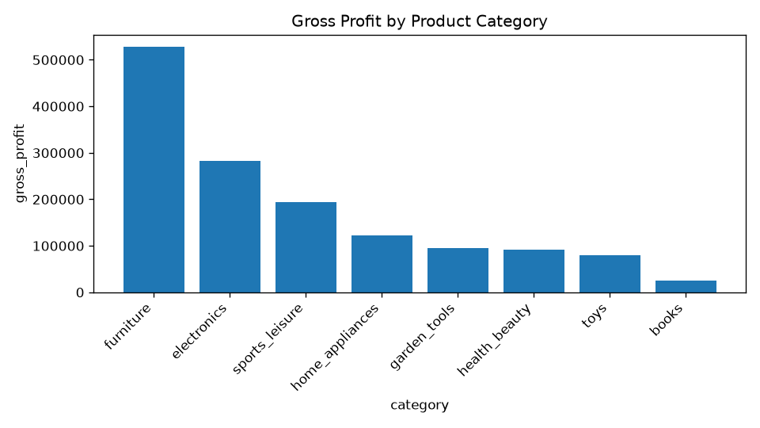

# Example: Gross profit by product category

**Question asked:** *"Which product categories have the highest gross profit?"*

> This is the toughest of the example questions - it requires joining
> `order_items` to `products` and computing profit as
> `(price − unit_cost) × quantity`, not just summing a column. The agent (on the
> cheap Haiku model) wrote it correctly.

## The agent's answer

1. **Furniture** - $527,941
2. **Electronics** - $281,847
3. **Sports & Leisure** - $194,316
4. **Home Appliances** - $122,195
5. **Garden Tools** - $95,307
6. **Health & Beauty** - $91,523
7. **Toys** - $79,950
8. **Books** - $26,002

Furniture is nearly double the next category; furniture, electronics, and
sports & leisure together drive most of the gross profit.



## The SQL the agent wrote

```sql
SELECT
  p.category,
  SUM((oi.price - p.unit_cost) * oi.quantity) AS gross_profit
FROM order_items oi
JOIN products p ON oi.product_id = p.product_id
GROUP BY p.category
ORDER BY gross_profit DESC;
```

## Human-in-the-loop verification ✅

I re-ran the calculation independently; every category figure matched exactly
(Furniture 527,941 … Books 26,002). The join and the profit formula are both
correct.

**Caveat noted by the agent:** this is gross profit only - it excludes shipping,
labor, and overhead, and doesn't filter by order status.
