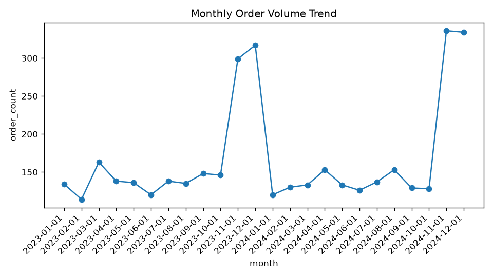

# Example: Monthly order volume over time

**Question asked:** *"How did monthly order volume trend over time?"*

## The agent's answer

Monthly order volume showed clear **seasonal patterns** over the 24-month period:

- **Baseline (Jan-Oct):** relatively stable, ~130-150 orders/month.
- **Holiday surge (Nov-Dec):** sharp spikes both years - 2023 hit 299 (Nov) /
  317 (Dec); 2024 hit 336 (Nov) / 334 (Dec).
- **Post-holiday dip:** January 2024 fell to ~120 before stabilizing.
- **Year-over-year:** the 2024 holiday peak slightly exceeded 2023's.



## The SQL the agent wrote

```sql
SELECT
  DATE(order_date, 'start of month') AS month,
  COUNT(DISTINCT order_id) AS order_count
FROM orders
GROUP BY DATE(order_date, 'start of month')
ORDER BY month ASC;
```

## Human-in-the-loop verification ✅

The query correctly buckets orders by month with `DATE(..., 'start of month')`
and counts distinct orders. The seasonal pattern it surfaced matches how the
dataset is structured (a deliberate November/December bump).

**Caveat noted by the agent:** it counts all orders regardless of status
(including canceled), so it measures demand placed, not orders fulfilled.
