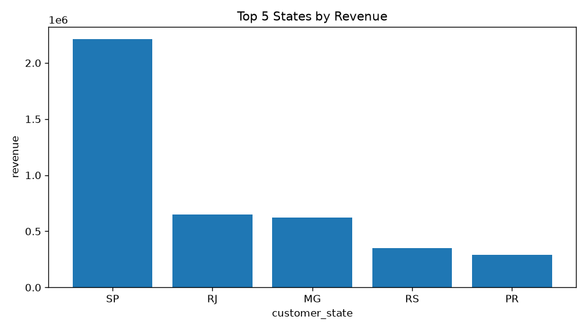

# Example: Revenue by state

**Question asked:** *"Which states generate the most revenue? Top 5."*

## The agent's answer

The top 5 states by revenue are:

1. **SP (São Paulo)** — $2,212,670
2. **RJ (Rio de Janeiro)** — $648,044
3. **MG (Minas Gerais)** — $621,062
4. **RS (Rio Grande do Sul)** — $350,868
5. **PR (Paraná)** — $292,418

São Paulo dominates, generating more than 3× the revenue of the second-place
state. These five states account for the large majority of revenue.



## The SQL the agent wrote

```sql
SELECT
  c.customer_state,
  SUM(oi.price * oi.quantity) AS revenue
FROM order_items oi
JOIN orders o ON oi.order_id = o.order_id
JOIN customers c ON o.customer_id = c.customer_id
GROUP BY c.customer_state
ORDER BY revenue DESC
LIMIT 5;
```

## Human-in-the-loop verification ✅

I re-ran the query independently against the database; every figure matched the
agent's answer exactly (SP 2,212,670 / RJ 648,044 / MG 621,062 / RS 350,868 /
PR 292,418). The agent's revenue definition — `SUM(price × quantity)` joined
across `order_items → orders → customers` — is the correct one for this question.

**Caveat noted by the agent:** revenue here reflects selling price, not gross
profit (margins aren't factored in). A natural follow-up is the gross-profit
version of the same ranking.
